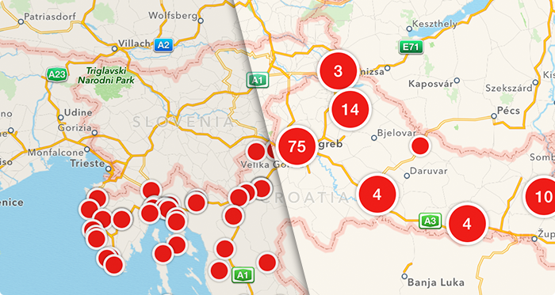

# FBAnnotationClustering

FBAnnotationClustering is an iOS library for clustering map notifications in an easy and performant way. Check out the [blog post](https://www.infinum.co/the-capsized-eight/articles/a-blazingly-fast-open-source-algorithm-for-poi-clustering-on-ios) about it.

  

## Usage

Create your clustering manager (and initialize with annotations or add annotations later):
	
	self.clusteringManager = [[FBClusteringManager alloc] initWithAnnotations:arrayOfAnnotations];
	
Implement MKMapView delegate method `mapView:regionDidChangeAnimated:` to display annotations grouped in clusters on the map. An example of implementation:

	- (void)mapView:(MKMapView *)mapView regionDidChangeAnimated:(BOOL)animated
	{
	    [[NSOperationQueue new] addOperationWithBlock:^{
	        double scale = self.mapView.bounds.size.width / self.mapView.visibleMapRect.size.width;
	        NSArray *annotations = [self.clusteringManager clusteredAnnotationsWithinMapRect:mapView.visibleMapRect withZoomScale:scale];
	        
	        [self.clusteringManager displayAnnotations:annotations onMapView:mapView];
	    }];
	}
	
**Important:** Call the method `mapView:regionDidChangeAnimated:` whenever you want to refresh currently visible map rectangle by yourself (for example, if you added annotations to `clusteringManager`)

All clusters will have `FBAnnotationCluster` class, so when MKMapView delegate methods are called, you can check if current annotation is cluster by checking its class. For example:

	- (MKAnnotationView *)mapView:(MKMapView *)mapView viewForAnnotation:(id<MKAnnotation>)annotation
	{   
	    if ([annotation isKindOfClass:[FBAnnotationCluster class]]) {
	        FBAnnotationCluster *cluster = (FBAnnotationCluster *)annotation;
	        NSLog(@"Annotation is cluster. Number of annotations in cluster: %lu", (unsigned long)cluster.annotations.count);
	    } else {
			NSLog(@"Normal annotation.")
	    }	
	        
	    ...
	} 

To run the example project; clone the repo, and run `pod install` from the Example directory first.

## Requirements

* iOS SDK 6
* ARC

## Installation

FBAnnotationClustering is available through [CocoaPods](http://cocoapods.org), to install
it simply add the following line to your Podfile:

    pod "FBAnnotationClustering"
    
If you don't like Cocapods, you can add all files from [FBAnnotationClustering](FBAnnotationClustering) directory to your project.

## TODO

* replace `NSRecursiveLock` with GCD serial queue
* `removeAnnotations:` method

		/**
		 Remove array of annotations from current annotation collection.
	 
		 @param annotations Custom annotation objects.
		 */
		- (void)removeAnnotations:(NSArray *)annotations;

## Author

Filip Beć, filip.bec@infinum.co

Maintained by [Infinum](http://www.infinum.co)

## Credits

FBAnnotationClustering is based on a blog post written by [thoughtbot](http://robots.thoughtbot.com/how-to-handle-large-amounts-of-data-on-maps).

## License

FBAnnotationClustering is available under the MIT license. See the LICENSE file for more info.

